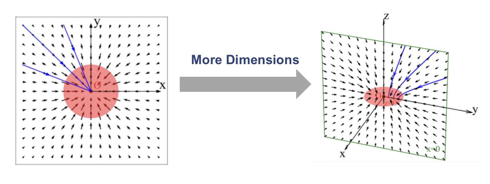

# PFGM 泊松流生成模型复现报告

- 作者：[任宇轩](https://github.com/YuX-Ren)，[禤科材](https://github.com/Bessgendre)
- 课程：Python 与深度学习基础（CS1507.01）
- 授课老师：[熊志伟](http://staff.ustc.edu.cn/~zwxiong/), [张越一](https://iat.ustc.edu.cn/iat/x223/20190911/2125.html)，[郑歆慰](https://iat.ustc.edu.cn/iat/x223/20190911/2127.html)

- 分工情况：任宇轩负责论文检索、代码修改、复现结果、报告书写等；禤科材负责论文翻译、PPT制作、报告书写、视频剪辑等。

- 视频地址：[什么模型能兼顾采样速度与生成质量？](https://www.bilibili.com/video/BV1vu411V7Va)

## 简介

&emsp;&emsp;泊松流模型是基于物理过程启发的一种新型生成模型，传统的生成模型诸如 GAN，normalize flow ，diffusion 等都存在一定的缺陷。以 diffusion 为例，diffusion 模型虽然采样质量较高但是采样缓慢且不稳定，而将 diffusion 过程所采用的随机微分方程（SDE）转化为常微分方程（ODE）的模型虽然一定程度上提高了采样速度，但是生成质量有所下降。为了解决这两个问题，作者从物理现象获得启发提出了泊松流生成模型（PFGM），这一模型用 ODE 框架达到了和 SDE 框架相匹配的生成质量。下表比较了流模型，离散扩散模型以及泊松流模型的优缺点：

|  | Flow Based Model | Diffusion SDE  | PFGM           |
| --------- | --------------------- | -------------- | -------------- |
| 稳定性 | 稳定                     | 不稳定     | 稳定       |
| 采样速度 | 中等                 | 低   | 中等   |
| 模型限制 | 必须存在逆映射             | 无限制     | 无限制     |
| 采样质量 | 糟糕         | 较好 | 较好 |

## 模型结构

&emsp;&emsp;本次使用的是该作者新发表的 PFGM++ 结构而非原始的 PFGM，这也导致了后续出现的问题。

&emsp;&emsp;PFGM 模型的基本思想是基于物理的启发，将相应生成维度的电场线视为概率流，将无穷远处的均匀分布与原点附近的任意分布通过常微分方程（ODE）联系起来，使得我们在较远的 $N$ 维球壳均匀采样后随电场线移动，即可达到生成的目的：

在物理上，高维电场线满足泊松方程：

$$
  \nabla^2 \varphi(x) = -\rho (x)
$$

边界条件给定后它具有唯一解：

$$
  \forall \tilde{\mathbf{x}} \in \mathbb{R} ^{N+1},E(\tilde{\mathbf{x}}) = -\nabla\varphi(\tilde{\mathbf{x}}) = \frac{1}{S_N(1)} \int \frac{\tilde{\mathbf{x}}  -\tilde{\mathbf{y}}}{\|\tilde{\mathbf{x}} - \tilde{\mathbf{y}}\|^{N+1}} p(\tilde{\mathbf{y}}) d\tilde{\mathbf{y}}
$$

因此，我们就可以设计一个神经网络来估计这些电场线的方向。由于输入（粒子的坐标）的维度和输出（粒子的方向）的维度一致，故和 diffusion model 一样，采取 Unet 结构进行预测。

&emsp;&emsp;由于我们的模型并不要求计算电场线的强度，所以还需要对这个场进行归一化处理，这样也能使得学习的数据在某个大小范围内保持一致，并更好收敛：

$$
  \hat{\mathbf{E}}(\tilde{\mathbf{x}})=c(\tilde{\mathbf{x}}) \sum_{i=1}^n \frac{\tilde{\mathbf{x}}-\tilde{\mathbf{x}}_i}{\left\|\tilde{\mathbf{x}}-\tilde{\mathbf{x}}_i\right\|^{N+1}}
$$

使用的 loss function 则为：

$$
  \mathcal{L}(\theta)=\frac{1}{|\mathcal{B}|} \sum_{i=1}^{|\mathcal{B}|}\left\|f_\theta\left(\tilde{\mathbf{y}}_i\right)-\mathbf{v}_{\mathcal{B}_L}\left(\tilde{\mathbf{y}}_i\right)\right\|_2^2
$$

&emsp;&emsp;然而，实际上除了需要生成的维度之外，还应增广维度以防止出现 Model-Collapse 现象，因为在物理上，半球上均匀分布的电荷产生的电场线将汇聚于原点，导致无法进行生成：

并且，选择增广的维度数量如果不同，会导致模型的性质不同（当设置为 $1$ 时即为 PFGM，设置为大于等于 $2$ 时即为推广的 PFGM++ 模型）：在低维情况下模型具有较好的鲁棒性，而在高维情况下模型更容易训练、更好收敛：

在这里我们选择了增广 $1$ 个维度和增广 $128$ 个维度进行复现。

&emsp;&emsp;我们选择的 PFGM++ 而非 PFGM 的原因是：原始代码中 PFGM 模型需要的环境是三种 dl 框架，但 bitahub 平台并不提供相应环境。我们也尝试了使用论文作者所提供的 dockerfile 自己构建 docker 环境，但由于 bitahub 的限制 [自定义镜像 · GitBook (ustc.edu.cn)](https://bitahub.ustc.edu.cn/help/md/7.6%20自定义镜像.html) 并未成功，故选择使用 PFGM++ 将增广维度设置为 $1 进行 PFGM 的复现，但其实 PFGM++ 并不只是将维度增加，它还同时修改了 loss function 的形式，这也导致了后续训练中 PFGM 的失败。

## 对代码进行的修改

&emsp;&emsp;由于原始模型是针对 PFGM++ 的，并未提供 dim=1 的情况，故需对代码进行少量修改。并且代码中的目录树结构与 bitahub要求的 `/data /code /output` 不兼容，故也需修改部分代码。

## 复现结果比较

### FID 指标

最后一行为 NFE(number of function evaluation)，可以简单理解为模型 inference 的步长：

| paper(dim=128)            | 1.91  |
| ------------------------- | ----- |
| check_point$^1$ (dim=128) | 1.917 |
| ours(dim=128)             | 2.17  |
| ours(dim=1)               | 261   |

### 复现图片的生成

&emsp;&emsp;我们使用 cifar 10 数据集训练模型，原始图片如下：

使用作者提供的模型 checkpoints 检查生成情况：

**check_point $^1$ (dim=128)**

**ours(dim=128)**

**ours(dim=1)**

可以看到 dim = 1 时可以模型可以生成一些相对较好的图像，但同时也得到了大量的乱码图像，从而导致 FID 非常高。而在 dim=128 时，无论是自己训练的，还是作者提供的模型都能得到较好的质量，且具有较低的 FID。

### 结果分析

&emsp;&emsp;对于 dim = 1 时的特殊情况，可能存在以下两点原因：**损失函数定义的不同**以及**维度数量对分布的影响**。

#### 损失函数差异

&emsp;&emsp;PFGM++ 的 loss function 与 PFGM 的并不相同。PFGM 的学习是一个 minibatch 图片作为数据点（poisson flow 中的点电荷）得到的 poisson 场线 $^{(1)}$，而 PFGM++ 除了维度更大之外，还对最初的损失函数进行了一定的修改则与 score based model 相似：学习微扰核分布下的分数 $^{(2)}$。上述的区别如下：

(1)：

(2)：

其中 $P_r(x|y)$ 是微扰核，这两种不同的训练方式导致不同的效果。

&emsp;&emsp;第一种是一种取 mini batch 来估计电场线的方法，由于它在训练时是选取一个 batch 的数据进行求和（PFGM论文指出只有在512能达到较好效果），每次学习的电场线方向的偏离较小，也减小了方差，使得网络也更好地训练和收敛：

&emsp;&emsp;第二种以微扰核进行训练的方法则不同，是基于一个数据先进行微扰，然后去学习去噪方向，这使得每次学习的方向偏移都比较大，方差比较大，使得模型在收敛上可能会遇到很大问题：

&emsp;&emsp;因而对于以微扰核为 loss function  的 PFGM++，如果 dim = 1，模型的训练是极难进行的，而由于 rigidity 低和以微扰核为 loss function，这使得训练得到的模型出现极大差距，也就是说生成较好图片的同时也生成了完全乱码的图片。

#### 维度数量对分布的影响

&emsp;&emsp;根据 PFGM++ 原文，不同的维度对应了模型不同的性质。模型维度越低，鲁棒性越好（训练好后的模型），但是模型 rigidity 更低，这导致了模型十分的难训练。下图展示了不同噪声强度下模型所学到的数据在不同模长下的分布：

&emsp;&emsp;可以看到，在维度较高时，模型所需要学习的只是一个很窄的分布，也就是说在学习较少数据之后，模型就能轻易收敛。但这导致了另一个问题，即是训练出的神经网络非常不稳定，鲁棒性较低。

&emsp;&emsp;而对于维度较低的情况，模型所需要学习的分布具有一定展宽，若想收敛，则要求模型对这个分布中的大多数点都有所认识，这使得训练过程比较困难。

## 总结

&emsp;&emsp;本次大作业复现了最新基于物理思想启发的泊松流生成模型，它不仅有 ODE 采样迅速的优点，又兼具可与 SDE 相媲美的图片生成质量。相比于原始工作，我们又比较了 dim = 1 与 dim = 128 时 PFGM++ 的性质：dim = 1 时可以模型可以生成一些相对较好的图像，但同时也得到了大量的乱码，从而导致 FID 非常高；而在 dim=128 时，模型生成的图片具有较高的质量，且具有较低的 FID。

&emsp;&emsp;对于其中的差别，我们认为原因有两个：损失函数定义差异以及维度数量对分布的影响。首先，对于以微扰核为损失函数的 PFGM++，如果 dim = 1，模型的训练极难进行，并且训练得到的模型出现极大差距；其次，维度的增加使得数据模长的分布更加密集，模型在学习较少数据就能轻易收敛，而对于较低维度，模型所需要历经的数据点具有更大的展宽，更难训练。
